# Roadmap_Full_Cycle
Roadmap Master — Full Cycle • Arquitetura • Produto • Liderança • Segurança • IA/ML

# Roadmap Master — Full Cycle • Arquitetura • Produto • Liderança • Segurança • IA/ML

**Autor**: Rhenan Sousa da Cunha (consolidação prática)  
**Última atualização**: 17/09/2025

---

## Sumário

- 0. Como usar este roadmap
- 1. Desenvolvimento Full Cycle
  - 1.1 Frontend
  - 1.2 Backend & Serviços
  - 1.3 Dados (SQL/NoSQL, Data Eng)
  - 1.4 DevOps, SRE & Plataforma
- 2. Arquitetura de Software (Especialização)
- 3. Visão de Negócios & Gestão de Produtos
- [4. Liderança & Mentoria](#. Segurança da Informação (DevSecOps)
- [6. Inteligência Artificial & Machine Learning (com MLOps)](#6-inteligência-artificialtares
- [8. Matriz de Proficiência (diagnóstico por área)](#8-matriz-de-proficiência-diagnóstico-por-áreabricas
- [10. Sequenciamento recomendado (etapas e duração)](#10-sequenciamento-re (E2E)
- [12. Referncias (docs oficiais)

---

## 0. Como usar este roadmap

- **Objetivo**: chegar a **Expert/Master** em Full Cycle, Arquitetura, Produto, Liderança, Segurança e IA/ML.  
- **Formato**: cada área traz **palavras‑chave**, **ferramentas**, **procedimentos**, **links oficiais**, **cursos/livros** e **projetos práticos**.  
- **Matriz de proficiência (Seção 8)**: auto‑diagnóstico por níveis (Básico/Intermediário/Avançado/Expert) e **evidências objetivas**.  
- **Sequenciamento (Seção 10)**: plano por fases com **tempo estimado**, **metas**, **entregáveis** e **gaps** esperados.

---

## 1. Desenvolvimento Full Cycle

### 1.1 Frontend
**Palavras‑chave**: HTML5, CSS3, JavaScript (ES2023+), TypeScript, SPA/SSR/SSG, PWA, A11y/WCAG, Web Vitals, SEO técnico.  
**Frameworks/Libs**: React, Next.js, Angular, Vue, Nuxt, Svelte/SvelteKit; estado (Redux Toolkit, Zustand, MobX, Pinia, RxJS); dados (TanStack Query, SWR).  
**Build/Test**: Vite, Webpack, SWC/Babel, Rollup; Jest, React Testing Library, Cypress, Playwright, Vitest; Storybook + Design Tokens.  
**Procedimentos**:
- A11y (WCAG 2.1), Core Web Vitals (LCP/CLS/INP), PWA offline‑first, code‑splitting e lazy, otimização de imagens e fontes.
- Contratos tipados (OpenAPI/GraphQL codegen), monitoramento de UI (Web Vitals) e rastreio de erros.

**Docs oficiais**: MDN Web Docs; React; Angular; Vue; Next.js; Svelte; TypeScript.  
**Cursos/Livros**: Meta Front‑End (Coursera), Angular Complete Guide, Vue Mastery; *You Don’t Know JS Yet*, *Patterns.dev*.  
**Projetos práticos**:
- Dashboard SSR (Next.js + React Query + Auth + Charting).  
- **Design System** com Storybook + Chromatic (testes visuais) + tokens.  
- PWA offline com Workbox e IndexedDB.

> **Fontes**: MDN e docs oficiais (React, Angular, Vue, Next.js, Svelte, TypeScript) [[1](https://kubernetes.io/docs/tutorials/kubernetes-basics/)].

---

### 1.2 Backend & Serviços
**Stack**: Java (Spring Boot/Quarkus), Python (Django/FastAPI/Flask), Node (Express/NestJS), Go (Gin/Fiber), C# (.NET), Rust (Axum/Actix).  
**APIs/Protocolos**: REST (OpenAPI/Swagger), GraphQL (Apollo/Hot Chocolate), gRPC (Protocol Buffers), WebSockets/SSE, BFF.  
**Resiliência**: idempotência, retries (jitter), circuit breaker, rate limit, backpressure, DLQ.  
**Mensageria/Eventos**: Kafka, RabbitMQ, SQS/SNS, Pub/Sub, NATS.  
**Persistência**: ORMs (Hibernate, Spring Data, SQLAlchemy, Prisma, TypeORM, EF Core), migrações (Flyway, Liquibase, Alembic).  
**Observabilidade**: health checks, **OpenTelemetry** (traces/métricas/logs), Micrometer/Prom client; logs estruturados.  
**Testes**: TDD/BDD, JUnit/PyTest/Mocha, Testcontainers; Pact (contract testing).

**Docs oficiais**: Spring Boot; FastAPI; Express; NestJS; ASP.NET Core; gRPC; GraphQL; OpenAPI [[1](https://kubernetes.io/docs/tutorials/kubernetes-basics/)].  
**Projetos práticos**:
- **API de pagamentos** (REST + idempotência + retries + DLQ em Kafka).  
- **BFF** GraphQL com Auth, caching e rate‑limit.  
- **Serviço gRPC** de arquivos (streaming) com storage S3‑compatível.

> **Fontes**: OpenTelemetry (instrumentação) [[2](https://nextjs.org/docs/app/guides/open-telemetry)]; Kafka (documentação de plataforma de streaming) [[3](https://mlflow.org/docs/latest/)]; RabbitMQ (mensageria AMQP) [[4](https://spring.io/guides/gs/messaging-rabbitmq/)].

---

### 1.3 Dados (SQL/NoSQL, Data Eng)
**Relacionais**: PostgreSQL, MySQL/MariaDB, SQL Server, Oracle — índices, particionamento, replicação, planos, MVCC.  
**NoSQL**: MongoDB (documento), Redis (cache), Cassandra/DynamoDB (colunar distribuído), Neo4j (grafo), Elasticsearch (busca).  
**DW/Lakehouse**: BigQuery, Snowflake, Redshift, ClickHouse; modelagem dimensional (Kimball), Data Vault.  
**Pipelines**: Airflow (orquestração), **dbt** (transform), **Debezium (CDC)**, Kafka Connect; linhagem (OpenLineage).  
**Projetos**:  
- **CDC**: Debezium → Kafka → Snowflake/BigQuery.  
- **Busca**: catálogo (Postgres) + Redis cache + Elasticsearch.

> **Fontes**: **Airflow** (orquestração de workflows) [[5](https://airflow.apache.org/docs/apache-airflow/stable/core-concepts/index.html)], **dbt** (documentação e lineage) [[6](https://docs.getdbt.com/docs/core/installation-overview)], **Debezium** (CDC) [[7](https://lokesh1729.com/posts/change-data-capture-debezium/)], **Kafka** [[3](https://mlflow.org/docs/latest/)].

---

### 1.4 DevOps, SRE & Plataforma
**Contêineres/Imagens**: Docker/Podman, multi‑stage, distroless, **SBOM**.  
**Orquestração**: **Kubernetes** (Deploy/Stateful/Ingress/HPA/VPA), **Helm**, **Kustomize**, service mesh (Istio/Linkerd).  
**CI/CD & GitOps**: GitHub Actions, GitLab CI, Jenkins, **Argo CD/Argo Workflows**, Tekton; trunk‑based, blue‑green, canary, feature flags.  
**IaC/Automação**: **Terraform**, Pulumi, **Ansible**, CloudFormation; Packer.  
**Observabilidade**: **Prometheus**, **Grafana**, Alertmanager, Loki, Tempo, Jaeger, **OpenTelemetry**; SLI/SLO/Error Budget.  
**Confiabilidade**: Chaos Engineering (Litmus), incidentes, runbooks/playbooks.

**Projetos**:  
- **Plataforma GitOps** (Argo CD + Helm + K8s) com promoções dev→stg→prod.  
- **Stack O11y**: OTel + Prometheus + Grafana + Loki + Tempo + Jaeger, SLOs por serviço.

> **Fontes**: **Kubernetes** & **Helm/Kustomize** [[1](https://kubernetes.io/docs/tutorials/kubernetes-basics/)[8](https://helm.sh/docs/intro/install/)[9](https://docs.cake.ai/docs/getting-started-with-kustomize)]; **Docker** [[10](https://docs.docker.com/get-started/docker-overview/)]; **Argo CD** (GitOps) [[11](https://docs.solo.io/gateway/main/installation/argocd/)]; **OpenTelemetry** [[2](https://nextjs.org/docs/app/guides/open-telemetry)]; **Prometheus/Grafana** [[12](https://deepwiki.com/prometheus/docs/1-overview)[13](https://grafana.com/docs/grafana/latest/)]; **Terraform/Ansible** [[14](https://terraform-docs.io/)[15](https://devdocs.io/ansible/)].

---

## 2. Arquitetura de Software (Especialização)
**Princípios**: SOLID, DRY, KISS, YAGNI, 12‑Factor; coesão/baixo acoplamento.  
**DDD**: Ubiquitous Language, Bounded Contexts, Context Maps, Aggregates, Entities, Value Objects, Domain Events, ACL.  
**Estilos**: monólito modular, microservices, event‑driven, serverless, micro‑frontends, data mesh.  
**Padrões**: CQRS, Event Sourcing, Sagas (orquestração/coreografia), Outbox, Strangler Fig, Bulkhead, Circuit Breaker, retries com jitter, BFF/API Gateway, versionamento de contratos.  
**Dados/Consistência**: CAP/PACELC, consistência eventual, 2PC vs Sagas, persistência poliglota, caching.  
**Governança/Docs**: C4 Model, UML, ADR, catálogos de padrões, Backstage (catálogo de serviços).

> **Fontes**: *Microservices.io* (catálogo de padrões de microserviços) [[11](https://docs.solo.io/gateway/main/installation/argocd/)]; CNCF/Cloud‑Native (projetos) [[1](https://kubernetes.io/docs/tutorials/kubernetes-basics/)].

---

## 3. Visão de Negócios & Gestão de Produtos
**Estratégia**: modelos (SaaS, PaaS, B2B, B2C, marketplace, PLG), Canvas/Lean Canvas, JTBD, 5 Forças de Porter.  
**Métricas**: North Star, OKRs, LTV, CAC, ARPU, churn, retention/cohorts, NPS, unit economics.  
**Discovery/UX**: Product Discovery, Design Thinking, UX Research (entrevistas, diários, testes), prototipação (Figma).  
**Priorização/Roadmap**: RICE, WSJF, Kano; roadmaps orientados a outcomes; dívidas x bets.  
**Entrega**: Scrum/Kanban/Shape Up; fluxo (lead/cycle time, throughput, WIP); **A/B/n** com MDE/poder estatístico.

> **Fontes**: Instrumentação de produto via **Amplitude/Mixpanel** (métricas e eventos) conforme docs de integração e práticas; observabilidade app/serviço com **OpenTelemetry/Prometheus/Grafana** [[2](https://nextjs.org/docs/app/guides/open-telemetry)[12](https://deepwiki.com/prometheus/docs/1-overview)[13](https://grafana.com/docs/grafana/latest/)].

---

## 4. Liderança & Mentoria
**Liderança técnica**: visão/guardrails, arquitetura evolutiva, RFC/Tech Spec, code review eficaz, gestão de dívida.  
**Times/Cultura**: squads/chapters/tribes, career ladders, matriz de competências, contratação, 1:1, feedback, segurança psicológica, métricas DORA.  
**Incidentes**: preparação, resposta, postmortems sem culpa, runbooks/playbooks, comunicação executiva.

> **Fontes**: Práticas SRE/observabilidade e métricas operacionais com **Prometheus/Grafana**; instrumentação com **OpenTelemetry** [[12](https://deepwiki.com/prometheus/docs/1-overview)[13](https://grafana.com/docs/grafana/latest/)[2](https://nextjs.org/docs/app/guides/open-telemetry)].

---

## 5. Segurança da Informação (DevSecOps)
**Fundamentos/modelagem**: CIA, STRIDE, PASTA, **OWASP ASVS**/**Top 10**.  
**Identidade/Acesso**: **OAuth 2.1** (PKCE obrigatório), **OpenID Connect**, **WebAuthn/Passkeys**; RBAC/ABAC; mTLS.  
**Criptografia**: TLS 1.2+, PKI/KMS/HSM; AES‑GCM/ChaCha20‑Poly1305, RSA/ECC, bcrypt/Argon2; rotação de chaves.  
**Secure SDLC/Supply chain**: SAST/DAST/IAST; SCA (Dependabot/Snyk); **SBOM** (**CycloneDX/SPDX**); **assinatura** de artefatos (**cosign/Sigstore**); políticas (OPA/Conftest); **SLSA**; scans (Trivy), imagens distroless.  
**Infra segura**: CIS Benchmarks, WAF, IDS/IPS, **Zero Trust**, segmentação, secrets (Vault/Secrets Manager), SIEM/SOAR.  
**Resposta a incidentes/Compliance**: LGPD/GDPR, PCI‑DSS, ISO 27001; triagem→lições aprendidas.

> **Fontes**: **OWASP Top 10/ASVS** [[16](https://www.gammal.tech/blog/owasp-top-10-2025.html)[17](https://devguide.owasp.org/en/03-requirements/05-asvs/)]; **OAuth 2.1** (IETF) e **OpenID Connect Core** [[18](https://datatracker.ietf.org/doc/html/draft-ietf-oauth-v2-1-13)[19](https://oauch.io/Documents/Info/OIDC)]; **WebAuthn (W3C)/Passkeys (FIDO)** [[20](https://developer.mozilla.org/en-US/docs/Web/API/Web_Authentication_API)[21](https://www.passkeycentral.org/introduction-to-passkeys/)]; **cosign/Sigstore** [[22](https://docs.digicert.com/en/software-trust-manager/code-signing/sign-with-third-party-signing-tools/container-images/sign-containers-with-cosign-using-pkcs11-library.html)]; **SLSA** [[23](https://jfrog.com/learn/grc/slsa-framework/)]; **CycloneDX/SPDX** [[24](https://owasp.org/www-project-cyclonedx/)[25](https://spdx.dev/)]; **Trivy** (scan contêiner) [[24](https://owasp.org/www-project-cyclonedx/)].

---

## 6. Inteligência Artificial & Machine Learning (com MLOps)
**Fundamentos**: regressão, classificação, clustering (K‑means/DBSCAN), redução (PCA/UMAP), validação cruzada; métricas (RMSE, ROC‑AUC, PR‑AUC, F1); desbalanceamento (SMOTE), leakage.  
**Deep Learning**: MLP, CNN, RNN/LSTM/GRU, atenção/Transformers, autoencoders, GANs, Diffusion; otimização (SGD/Adam/AdamW), regularização, normalização.  
**Stack Python**: NumPy, Pandas, SciPy, scikit‑learn; visualização (Matplotlib/Seaborn/Plotly).  
**NLP/LLMs & RAG**: Hugging Face (Transformers/Datasets), tokenização (SentencePiece/BPE), **RAG** com FAISS/Milvus/Weaviate/Pinecone; avaliação (BLEU/ROUGE/BERTScore).  
**Visão**: OpenCV, augmentations, Detectron2, YOLOv8.  
**Eng. de Dados p/ IA**: Airflow/Prefect, Kafka, **Feature Store (Feast)**; Lakehouse (S3/GCS/ADLS + Iceberg/Delta/Hudi).  
**MLOps**: **MLflow** (experimentos/registry), **Kubeflow Pipelines**, **KServe**, **BentoML**; deploy (batch/online, shadow/canary), monitoramento (Evidently AI/WhyLabs).

> **Fontes**: **Feast** (feature store) [[26](https://mljourney.com/how-to-version-and-track-features-with-feast-feature-store/)]; **MLflow** (ciclo de vida ML) [[27](https://pypi.org/project/mlflow/)]; **Kubeflow Pipelines** [[28](https://www.kubeflow.org/docs/components/pipelines/overview/)]; **KServe** (model serving serverless) [[29](https://mlserver.readthedocs.io/en/latest/user-guide/deployment/kserve.html)]; **BentoML** (inference platform) [[30](https://docs.bentoml.com/en/latest/examples/overview.html)].

---

## 7. Conhecimentos Complementares
**FinOps**: showback/chargeback, rightsizing, reserved/spot, autoscaling guiado por SLO; Infracost, Kubecost.  
**Edge/IoT**: AWS IoT Core/Greengrass, Azure IoT Hub/Edge, MQTT; latência/OTA.  
**Low‑code/No‑code**: Power Platform, OutSystems, Mendix (MVP/backoffice).  
**Legados**: ESB vs API Gateway (Kong, Apigee), ACL anti‑corrupção, Strangler Fig, CDC/ETL.

---

## 8. Matriz de Proficiência (diagnóstico por área)

> **Como ler**: marque o **nível mais alto** em que você cumpre **todas** as evidências. Use a seção 9 para provas rápidas de validação.

| Área | Básico (B) | Intermediário (I) | Avançado (A) | Expert (E) |
|---|---|---|---|---|
| **Frontend** | Domina HTML/CSS/JS moderno; constrói SPA simples; testes unitários básicos. | Usa TypeScript; otimiza Web Vitals; PWA; testes E2E (Cypress/Playwright). | SSR (Next/Nuxt) com caching/ISR; Design System com Storybook; A11y/WCAG; observabilidade de UI. | Lidera plataforma de UI (design tokens, monorepo), migrações (React/Angular), padroniza DX, mede impacto em produto. |
| **Backend** | CRUD REST com autenticação básica; ORM/migrações. | gRPC/GraphQL; BFF; patterns (retry/circuit breaker/idempotência); testes de contrato. | Event‑driven (Kafka/RabbitMQ), DLQ, Sagas; observabilidade (OTel); hardening. | Diretriz de serviços, SLAs, multi‑região; governança de APIs; performance profiling em produção. |
| **Dados** | SQL sólido; modelagem normalizada; ETL simples. | NoSQL (Mongo/Redis), DW (BigQuery/Snowflake); Airflow+dbt; CDC (Debezium). | Data mesh/lakehouse; otimização de partições/índices; qualidade/linhagem (OpenLineage). | Arquitetura de dados escalável; custo/performance (FinOps); compliance/mascaramento. |
| **DevOps/SRE** | Docker; CI/CD básico; logs/metrics iniciais. | Kubernetes (Deploy/Ingress/HPA), Helm; GitOps (Argo CD); SLOs iniciais. | Observabilidade completa (OTel+Prom+Grafana+Loki+Tempo); caos; runbooks. | Arquitetura de plataforma; multi‑cluster/ambient multi‑cloud; confiabilidade por design. |
| **Arquitetura** | SOLID/Clean Code; C4/UML básico. | DDD (tático), monólito modular; ADRs; versionamento de contrato. | Microservices/event‑driven; CQRS/ES, Sagas, Outbox; BFF/API Gateway; trade‑offs CAP/PACELC. | Arquitetura evolutiva/gov; catálogos/padrões; migrações complexas (Strangler Fig) com baixo risco. |
| **Produto** | OKRs básicos; backlog; histórias de usuário. | RICE/WSJF/Kano; analytics de produto; experimentos A/B com MDE. | Roadmaps por outcomes; instrumentação robusta de eventos; análise por cohorts. | Estratégia PLG; portfólio multi‑produto; alinhamento executivo e métricas financeiras. |
| **Liderança** | Comunica com clareza; feedback básico. | 1:1s, career ladders; coordena rituais ágeis; resolve conflitos. | Define guardrails/visão técnica; lidera incidentes & postmortems; cultura de excelência. | Forma líderes; estratégia técnica da organização; influência sem autoridade em escala. |
| **Segurança** | OWASP Top 10; OAuth básico; TLS. | OIDC/OAuth 2.1 c/ PKCE; SBOM; SAST/DAST/SCA; secrets management. | SLSA; assinatura cosign; Zero Trust; WAF/IDS; threat modeling. | Programa DevSecOps; compliance (ISO/LGPD/PCI) e resposta a incidentes em escala. |
| **IA/ML** | sklearn básico; métricas/validação; notebooks limpos. | DL (PyTorch/TensorFlow); pipelines (Airflow); serving local. | MLOps (MLflow/KFP/KServe/BentoML), feature store (Feast); monitoramento (Evidently). | Plataformas de ML escaláveis; RAG/LLMs c/ guardrails; Responsible AI (fairness/privacidade) em produção. |

---

## 9. Diagnóstico prático: provas, critérios e rubricas

- **Prova 1 — API resiliente** (Backend, 4–6h): implementar **idempotência**, retries com jitter, **circuit breaker**, tracing OTel e **DLQ** em Kafka + testes de contrato (Pact).  
  - **Atinge I** se cumpre idempotência/retry; **A** se inclui tracing/metrics + DLQ; **E** se mede SLO e faz canary.
  - Referências: OTel; Kafka [[2](https://nextjs.org/docs/app/guides/open-telemetry)[3](https://mlflow.org/docs/latest/)].

- **Prova 2 — Deploy GitOps** (DevOps/SRE, 4–6h): K8s + **Helm** + **Argo CD**; pipeline CI gera **SBOM** e assina artefatos com **cosign**.  
  - **I** se entrega GitOps com sync automático; **A** se inclui SLOs e alertas; **E** se aplica canary e política de rollback automatizada.  
  - Referências: K8s/Helm/Argo CD; cosign; CycloneDX [[1](https://kubernetes.io/docs/tutorials/kubernetes-basics/)[8](https://helm.sh/docs/intro/install/)[11](https://docs.solo.io/gateway/main/installation/argocd/)[22](https://docs.digicert.com/en/software-trust-manager/code-signing/sign-with-third-party-signing-tools/container-images/sign-containers-with-cosign-using-pkcs11-library.html)[24](https://owasp.org/www-project-cyclonedx/)].

- **Prova 3 — Produto orientado a outcomes** (Produto, 3–4h): definir **North Star**, OKRs e experimento A/B com MDE, instrumentado.  
  - **I** se mede eventos; **A** se apresenta análise por cohorts; **E** se conecta a métricas financeiras.

- **Prova 4 — MLOps E2E** (IA/ML, 1 dia): pipeline KFP/MLflow, **Feast** (features), **KServe** deploy online, monitoramento de drift (Evidently).  
  - **I** se treina e versiona; **A** se faz deploy online + canary; **E** se implementa monitoramento e rollback automático.  
  - Referências: MLflow/KFP/KServe/Feast [[27](https://pypi.org/project/mlflow/)[28](https://www.kubeflow.org/docs/components/pipelines/overview/)[29](https://mlserver.readthedocs.io/en/latest/user-guide/deployment/kserve.html)[26](https://mljourney.com/how-to-version-and-track-features-with-feast-feature-store/)].

- **Prova 5 — DevSecOps** (Segurança, 4–6h): pipeline com **SAST/DAST/SCA**, **SBOM** (CycloneDX/SPDX), **cosign** e política SLSA.  
  - **I** com SAST/DAST/SCA; **A** com SBOM+assinatura; **E** com controles SLSA e governança.  
  - Referências: OWASP/ASVS; CycloneDX/SPDX; SLSA; cosign [[16](https://www.gammal.tech/blog/owasp-top-10-2025.html)[17](https://devguide.owasp.org/en/03-requirements/05-asvs/)[24](https://owasp.org/www-project-cyclonedx/)[25](https://spdx.dev/)[23](https://jfrog.com/learn/grc/slsa-framework/)[22](https://docs.digicert.com/en/software-trust-manager/code-signing/sign-with-third-party-signing-tools/container-images/sign-containers-with-cosign-using-pkcs11-library.html)].

---

## 10. Sequenciamento recomendado (etapas e duração)

> **Regra de ouro**: sempre *fechar ciclo* com **projeto prático versionado**, **docs/ADRs** e **métricas**.

1. **Fase 0 — Pré‑requisitos (2–4 semanas)**  
   Linux+Git+HTTP/HTTPS/TLS; fundamentos de programação e testes; Introdução a Docker.

2. **Fase 1 — Full Cycle (8–10 semanas)**  
   - **Frontend/Backend** sólidos + **Dados** (ETL/CDC/dbt) + **observabilidade**.  
   - Entregável: **API resiliente** + **Dashboard** + **CDC** em DW.

3. **Fase 2 — DevOps/SRE (6–8 semanas)**  
   - K8s, Helm, GitOps (Argo CD), IaC (Terraform/Ansible), SLOs; **Prova 2**.  
   - Entregável: **Plataforma GitOps** e **stack O11y**.

4. **Fase 3 — Arquitetura (6–8 semanas)**  
   - DDD, CQRS/ES, Sagas, Outbox, BFF; **ADRs** e **C4**; migração Strangler Fig.

5. **Fase 4 — Segurança (5–6 semanas)**  
   - OAuth 2.1 + OIDC + WebAuthn/Passkeys; SDLC seguro (**SAST/DAST/SCA/SBOM**), **cosign**, **SLSA**; **Prova 5**.

6. **Fase 5 — IA/ML + MLOps (8–10 semanas)**  
   - sklearn→DL; MLflow/KFP/**KServe**/**BentoML**; **Feast**; monitoramento (Evidently). **Prova 4**.

7. **Fase 6 — Produto & Liderança (4–6 semanas)**  
   - North Star/OKRs; A/B; métricas; rituais e DORA; **Prova 3**.

> Ajuste buffers (15–20%) e intercale **capstones** (Seção 11) entre fases para consolidar.

---

## 11. Projetos Capstone (E2E)

- **A) E‑commerce Cloud‑Native**: Next.js + GraphQL BFF + NestJS microservices + Kafka + Postgres + Redis + K8s/Helm + Argo CD + OTel/Prom/Grafana + OIDC/RBAC + recomendações com **KServe**.  
  Referências: K8s/Helm/Argo CD; Observabilidade OTel/Prom/Grafana [[1](https://kubernetes.io/docs/tutorials/kubernetes-basics/)[8](https://helm.sh/docs/intro/install/)[11](https://docs.solo.io/gateway/main/installation/argocd/)[2](https://nextjs.org/docs/app/guides/open-telemetry)[12](https://deepwiki.com/prometheus/docs/1-overview)[13](https://grafana.com/docs/grafana/latest/)].

- **B) Data Platform & MLOps**: Kafka/**Debezium** → S3+Iceberg → Airflow+**dbt** → DW (Snowflake/BigQuery) → MLflow/**Feast** → **KServe/KFP** → **Evidently** (drift).  
  Referências: Debezium; Airflow; dbt; MLflow; Feast; KFP; KServe [[7](https://lokesh1729.com/posts/change-data-capture-debezium/)[5](https://airflow.apache.org/docs/apache-airflow/stable/core-concepts/index.html)[6](https://docs.getdbt.com/docs/core/installation-overview)[27](https://pypi.org/project/mlflow/)[26](https://mljourney.com/how-to-version-and-track-features-with-feast-feature-store/)[28](https://www.kubeflow.org/docs/components/pipelines/overview/)[29](https://mlserver.readthedocs.io/en/latest/user-guide/deployment/kserve.html)].

- **C) Observabilidade & Confiabilidade**: instrumentação **OpenTelemetry** (auto/sem código) + Prometheus + Tempo/Jaeger + Loki; SLOs e budgets; caos (Litmus).  
  Referências: OpenTelemetry; Prometheus; Grafana [[2](https://nextjs.org/docs/app/guides/open-telemetry)[12](https://deepwiki.com/prometheus/docs/1-overview)[13](https://grafana.com/docs/grafana/latest/)].

---

## 12. Referências (docs oficiais)

- **Kubernetes/Helm/Kustomize** [[1](https://kubernetes.io/docs/tutorials/kubernetes-basics/)[8](https://helm.sh/docs/intro/install/)[9](https://docs.cake.ai/docs/getting-started-with-kustomize)] • **Docker** [[10](https://docs.docker.com/get-started/docker-overview/)] • **Argo CD** [[11](https://docs.solo.io/gateway/main/installation/argocd/)]  
- **OpenTelemetry** [[2](https://nextjs.org/docs/app/guides/open-telemetry)] • **Prometheus** [[12](https://deepwiki.com/prometheus/docs/1-overview)] • **Grafana** [[13](https://grafana.com/docs/grafana/latest/)]  
- **Airflow** [[5](https://airflow.apache.org/docs/apache-airflow/stable/core-concepts/index.html)] • **dbt** [[6](https://docs.getdbt.com/docs/core/installation-overview)] • **Kafka** [[3](https://mlflow.org/docs/latest/)] • **RabbitMQ** [[4](https://spring.io/guides/gs/messaging-rabbitmq/)] • **Debezium** [[7](https://lokesh1729.com/posts/change-data-capture-debezium/)]  
- **OWASP Top 10** [[16](https://www.gammal.tech/blog/owasp-top-10-2025.html)] • **ASVS** [[17](https://devguide.owasp.org/en/03-requirements/05-asvs/)] • **OAuth 2.1** [[18](https://datatracker.ietf.org/doc/html/draft-ietf-oauth-v2-1-13)] • **OIDC** [[19](https://oauch.io/Documents/Info/OIDC)] • **WebAuthn** [[20](https://developer.mozilla.org/en-US/docs/Web/API/Web_Authentication_API)] • **Passkeys (FIDO)** [[21](https://www.passkeycentral.org/introduction-to-passkeys/)]  
- **cosign/Sigstore** [[22](https://docs.digicert.com/en/software-trust-manager/code-signing/sign-with-third-party-signing-tools/container-images/sign-containers-with-cosign-using-pkcs11-library.html)] • **SLSA** [[23](https://jfrog.com/learn/grc/slsa-framework/)] • **CycloneDX** [[24](https://owasp.org/www-project-cyclonedx/)] • **SPDX** [[25](https://spdx.dev/)]  
- **MLflow** [[27](https://pypi.org/project/mlflow/)] • **Feast** [[26](https://mljourney.com/how-to-version-and-track-features-with-feast-feature-store/)] • **Kubeflow Pipelines** [[28](https://www.kubeflow.org/docs/components/pipelines/overview/)] • **KServe** [[29](https://mlserver.readthedocs.io/en/latest/user-guide/deployment/kserve.html)] • **BentoML** [[30](https://docs.bentoml.com/en/latest/examples/overview.html)]

```mermaid
graph TD
    subgraph "Fase 1: Início no Celular"
        A[Início do Atendimento] --> B{Reconhecimento Facial};
        B -- Válido --> C[Cadastro/Login];
        B -- Inválido --> A;
        C --> D[Preenchimento da Ficha do Paciente];
        D --> E["- Dados Pessoais (Nome, Idade, etc.)<br>- Histórico Familiar<br>- Histórico Médico Pessoal<br>- Medicamentos em Uso<br>- Alergias Conhecidas<br>- Tipo Sanguíneo, Peso, Altura<br>- Plano de Saúde<br>- Condições Especiais (Ex: Síndrome Vasovagal)"];
        E --> F{Como deseja informar os sintomas?};
        F -->|Digitar ou Pré-selecionar| G[Seleção de Sintomas via Checkbox/Texto];
        F -->|Falar| H[Conversão de Voz para Texto dos Sintomas];
        G --> I[Análise dos Sintomas e Dados];
        H --> I;
    end

    subgraph "Fase 2: Direcionamento ao Hospital"
        I --> J{Sistema busca hospitais};
        J --> K["Critérios:<br>- Compatibilidade com Plano<br>- Especialidade Necessária<br>- Vaga Disponível"];
        K --> L{Paciente possui transporte próprio?};
        L -- Sim --> M{Escolha do Hospital};
        M -->|Mais Próximo| N[Rota Gerada para o Hospital];
        M -->|Melhor Avaliado| N;
        L -- Não --> O[Solicitar Transporte Hospitalar];
        O --> P[Localização do Paciente Enviada];
        P --> Q[Aguardar Transporte];
        N --> R[Paciente a Caminho do Hospital];
        Q --> R;
    end

    subgraph "Fase 3: Chegada e Triagem no Totem"
        R --> S[Chegada ao Hospital];
        S --> T[Totem de Autoatendimento];
        T --> U["Ler QR Code para Sincronizar<br>com o Atendimento do Celular"];
        U --> V[Medição Automática de Sinais Vitais];
        V --> W["- Oxigenação Sanguínea<br>- Pressão Arterial<br>- Temperatura<br>- Batimentos Cardíacos"];
        W --> X["Análise Integrada dos Dados<br>(Sintomas + Sinais Vitais)"];
        X --> Y{Classificação de Risco};
    end

    subgraph "Fase 4: Encaminhamento e Atendimento"
        Y -- Baixa Criticidade --> Z["<font color='green'><b>RISCO VERDE</b></font>"];
        Y -- Média Criticidade --> AA["<font color='yellow'><b>RISCO AMARELO</b></font>"];
        Y -- Alta Criticidade --> AB["<font color='red'><b>RISCO VERMELHO</b></font>"];
        Z --> AC["Tela do Totem:<br>Paciente direcionado para a<br>Ala de Atendimento correspondente"];
        AA --> AC;
        AB --> AC;
        AC --> AD[Médico Acessa o Laudo Completo<br>do Paciente no Sistema];
    end
```

